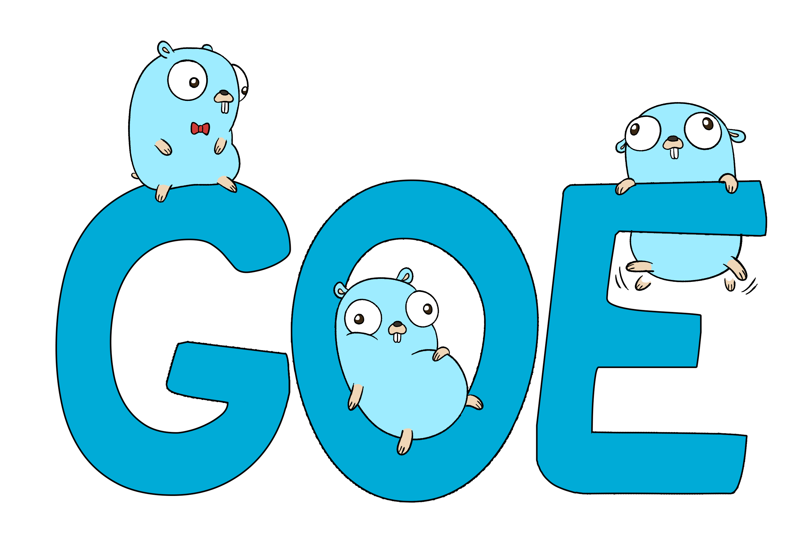

# GOE
A type safe SQL like ORM for Go

[](https://github.com/go-goe/goe/actions)
[](https://goreportcard.com/report/github.com/go-goe/goe)
[](https://pkg.go.dev/github.com/go-goe/goe)
[](https://opensource.org/licenses/MIT)


*GOE logo by [Luanexs](https://www.instagram.com/luanexs/)*

## Content
- [Install](#install)
- [Available Drivers](#available-drivers)
    - [PostgreSQL](#postgresql)
	- [SQLite](#sqlite)
- [Quick Start](#quick-start)
- [Database](#database)
	- [Struct Mapping](#struct-mapping)
	- [Setting primary key](#setting-primary-key)
	- [Setting type](#setting-type)
	- [Relationship](#relationship)
		- [One to One](#one-to-one)
		- [Many to One](#many-to-one)
		- [Many to Many](#many-to-many)
		- [Self Referential](#self-referential)
	- [Index](#index)
		- [Create Index](#create-index)
		- [Unique Index](#unique-index)
		- [Function Index](#function-index)
		- [Two Columns Index](#two-columns-index)
	- [Logging](#logging)
	- [Open And Migrate](#open-and-migrate)
- [Select](#select)
	- [Find](#find)
	- [List](#list)
	- [Select From](#select-from)
	- [Select Specific Fields](#select-specific-fields)
	- [Where](#where)
	- [Join](#join)
	- [OrderBy](#orderby)
	- [Pagination](#pagination)
	- [Aggregates](#aggregates)
	- [Functions](#functions)
- [Insert](#insert)
	- [Create](#create)
	- [Insert One](#insert-one)
	- [Insert Batch](#insert-batch)
- [Update](#update)
	- [Save](#save)
	- [Update Set](#update-set)
- [Delete](#delete)
	- [Remove](#remove)
	- [Delete Batch](#delete-batch)
- [Transaction](#transaction)
	- [Begin Transaction](#begin-transaction)
	- [Commit and Rollback](#commit-and-rollback)
	- [Isolation](#isolation)

## Install
```
go get github.com/go-goe/goe
```
As any database/sql support in go, you have to get a specific driver for your database, check [Available Drivers](#available-drivers)

## Available Drivers
### PostgreSQL
```
go get github.com/go-goe/postgres
```
#### Usage
```go
type Animal struct {
	// animal fields
}

type Database struct {
	Animal         *Animal
	*goe.DB
}

dns := "user=postgres password=postgres host=localhost port=5432 database=postgres"
db, err := goe.Open[Database](postgres.Open(dns, postgres.Config{}))
```

### SQLite
```
go get github.com/go-goe/sqlite
```

#### Usage
```go
type Animal struct {
	// animal fields
}

type Database struct {
	Animal         *Animal
	*goe.DB
}

db, err := goe.Open[Database](sqlite.Open("goe.db", sqlite.Config{}))
```
## Quick Start
```go
package main

import (
	"fmt"

	"github.com/go-goe/goe"
	"github.com/go-goe/sqlite"
)

type Animal struct {
	ID    int
	Name  string
	Emoji string
}

type Database struct {
	Animal *Animal
	*goe.DB
}

func main() {
	db, err := goe.Open[Database](sqlite.Open("goe.db", sqlite.Config{}))
	if err != nil {
		panic(err)
	}
	defer goe.Close(db)

	err = goe.AutoMigrate(db)
	if err != nil {
		panic(err)
	}

	err = goe.Delete(db.Animal).All()
	if err != nil {
		panic(err)
	}

	animals := []Animal{
		{Name: "Cat", Emoji: "🐈"},
		{Name: "Dog", Emoji: "🐕"},
		{Name: "Rat", Emoji: "🐀"},
		{Name: "Pig", Emoji: "🐖"},
		{Name: "Whale", Emoji: "🐋"},
		{Name: "Fish", Emoji: "🐟"},
		{Name: "Bird", Emoji: "🐦"},
	}

	err = goe.Insert(db.Animal).All(animals)
	if err != nil {
		panic(err)
	}

	animals, err = goe.List(db.Animal).AsSlice()
	if err != nil {
		panic(err)
	}
	fmt.Println(animals)
}
```
## Database
```go
type Database struct {
	User    	*User
	Role    	*Role
	UserLog 	*UserLog
	*goe.DB
}
```
In goe, it's necessary to define a Database struct,
this struct implements *goe.DB and a pointer to all
the structs that's it's to be mappend.

It's through the Database struct that you will
interact with your database.
### Struct mapping
```go
type User struct {
	Id        	uint //this is primary key
	Login     	string
	Password  	string
}
```
> By default the field "Id" is primary key and all ids of integers are auto increment

[Back to Contents](#content)
### Setting primary key
```go
type User struct {
	Identifier	uint `goe:"pk"`
	Login     	string
	Password	string
}
```
In case you want to specify 
a primary key use the tag value "pk".

[Back to Contents](#content)
### Setting type
```go
type User struct {
	Id       	string `goe:"pk;type:uuid"`
	Login    	string `goe:"type:varchar(10)"`
	Name     	string `goe:"type:varchar(150)"`
	Password 	string `goe:"type:varchar(60)"`
}
```
You can specify a type using the tag value "type"

[Back to Contents](#content)

### Setting null
```go
type User struct {
	Id        int
	Name      string
	Email     *string // this will be a null column
}
```

A pointer is considered a null column in Database.

[Back to Contents](#content)

> Default values will be added in future features.

### Relationship
In goe relational fields are created using the pattern TargetTable+TargetTableId, so if you want to have a foreign key to User, you will have to write a field like "UserId" or "IdUser".
#### One To One
```go
type User struct {
	Id       	uint
	Login    	string
	Name     	string
	Password 	string
}

type UserDetails struct {
	Id       	uint
	Email   	string
	Birthdate 	time.Time
	UserId   	uint // one to one with User
}
```

[Back to Contents](#content)
#### Many To One
**For simplifications all relational slices should be the last fields on struct.**
```go
type User struct {
	Id       	uint
	Name     	string
	Password 	string
	UserLogs 	[]UserLog // one User has many UserLogs
}

type UserLog struct {
	Id       	uint
	Action   	string
	DateTime 	time.Time
	UserId   	uint // if remove the slice from user, will became a one to one
}
```

The difference from one to one and many to one it's the add of a slice field on the "many" struct

[Back to Contents](#content)
#### Many to Many
**For simplifications all relational slices should be the last fields on struct.**
```go
type User struct {
	Id       	uint
	Name     	string
	Password 	string
	UserRoles 	[]UserRole
}

type UserRole struct {
	UserId  	uint `goe:"pk"`
	RoleId  	uint `goe:"pk"`
}

type Role struct {
	Id        	uint
	Name      	string
	UserRoles 	[]UserRole
}
```
Is used a combination of two many to one to generate a many to many. In this example, User has many UserRole and Role has many UserRole.

It's used the tags "pk" for ensure that the foreign keys will be both primary key.

[Back to Contents](#content)

#### Self-Referential

One to Many

```go
type Page struct {
	Id     int
	Number int
	PageId *int
	Pages  []Page
}
```

One to One

```go
type Page struct {
	Id     int
	Number int
	PageId *int
}
```

[Back to Contents](#content)
### Index
#### Unique Index
```go
type User struct {
	Id       	uint
	Name     	string
	Email    	string  `goe:"unique"`
}
```
To create a unique index you need the "unique" goe tag

[Back to Contents](#content)
#### Create Index
```go
type User struct {
	Id       uint
	Name     string
	Email 	 string `goe:"index"`
}
```
To create a common index you need the "index" goe tag

[Back to Contents](#content)
<!-- #### Function Index
```
type User struct {
	Id       uint
	Name     string
	Email    string `goe:"index(n:idx_email f:lower)"`
}
```
> To create a function index you need to pass the "f" parameter with the function name -->
#### Two Columns Index
```go
type User struct {
	Id       uint
	Name    string `goe:"index(n:idx_name_status)"`
	Email   string `goe:"index(n:idx_name_status);unique"`
}
```

Using the goe tag "index()", you can pass the index infos as a function call. "n:" is a parameter for name, to have a two column index just need two indexes with same name. You can use the semicolon ";" to create another single index for the field.

[Back to Contents](#content)

#### Two Columns Unique Index
```go
type User struct {
	Id       uint
	Name    string `goe:"index(unique n:idx_name_status)"`
	Email   string `goe:"index(unique n:idx_name_status);unique"`
}
```

Just as creating a [Two Column Index](#two-columns-index) but added the "unique" value inside the index function.

> Function indexes will be added in future features.

[Back to Contents](#content)

## Logging

GOE supports any logger that implements the Logger interface

```go
type Logger interface {
	InfoContext(ctx context.Context, msg string, kv ...any)
	WarnContext(ctx context.Context, msg string, kv ...any)
	ErrorContext(ctx context.Context, msg string, kv ...any)
}
```

The logger is defined on database opening
```go
db, err := goe.Open[Database](sqlite.Open("goe.db", sqlite.Config{
		DatabaseConfig: goe.DatabaseConfig{
			Logger:           slog.New(slog.NewTextHandler(os.Stdout, &slog.HandlerOptions{Level: slog.LevelInfo})),
			IncludeArguments: true,
			QueryThreshold:   time.Second},
	}))
```

> You can use slog as your standard logger or make a adapt over the Logger interface 

[Back to Contents](#content)

## Open and Migrate
To open a database use `goe.Open` function, it's require a valid driver. Most of the drives will require a dns/path connection and a config setup. On `goe.Open` needs to specify the struct database.

To migrate the structs, use the `goe.AutoMigrate` passing the database returned by `goe.Open`.

If you don't need the database connection anymore, call `goe.Close` to ensure that all the database resources will be removed from memory.

```go
type Database struct {
	Animal         *Animal
	AnimalFood     *AnimalFood
	Food           *Food
	*goe.DB
}

dns := "user=postgres password=postgres host=localhost port=5432 database=postgres"

db, err := goe.Open[Database](postgres.Open(dns, postgres.Config{}))

if err != nil {
	// handler error
}
defer goe.Close(db)

// migrate all database structs
err = goe.AutoMigrate(db)
if err != nil {
	// handler error
}
```

> You can use the postgres.Config{} to active a log that will print all the queries. Also db.Log() it's a alternativly way of active or deactive the logs at any time.
## Select
### Find
Find is used when you want to return a single result.
```go
// one primary key
animal, err = goe.Find(db.Animal).ById(Animal{Id: 2})

// two primary keys
animalFood, err = goe.Find(db.AnimalFood).ById(AnimalFood{IdAnimal: 3, IdFood: 2})

// find record by value, if have more than one it will returns the first
cat, err = goe.Find(db.Animal).ByValue(Animal{Name: "Cat"})
```

> Use **goe.FindContext** for specify a context

> Use **OnErrNotFound** to replace ErrNotFound with a new error

> Use **OnErrBadRequest** to replace ErrBadRequest with a new error

[Back to Contents](#content)
### List

List has support for [OrderBy](#orderby), [Pagination](#pagination) and [Joins](#select-join).

```go
// list all animals
animals, err = goe.List(db.Animal).AsSlice()

// list the animals with name "Cat", Id "3" and IdHabitat "4"
animals, err = goe.List(db.Animal).Filter(Animal{Name: "Cat", Id: 3, IdHabitat: 4}).AsSlice()

// when using % on filter, goe makes a like operation
animals, err = goe.List(db.Animal).Filter(Animal{Name: "%Cat%"}).AsSlice()
```

> Use **goe.ListContext** for specify a context

[Back to Contents](#content)
### Select From

Return all animals as a slice
```go
// select * from animals
animals, err = goe.Select(db.Animal).From(db.Animal).AsSlice()

if err != nil {
	// handler error
}
```

> Use **goe.SelectContext** for specify a context

[Back to Contents](#content)

### Select Iterator

Iterate over the rows
```go
for row, err := range goe.Select(db.Animal).From(db.Animal).Rows() {
	// iterator rows
 }
```

[Back to Contents](#content)

### Select Specific Fields
```go
// return a slice of this struct
animals, err = goe.Select(&struct {
		User    *string
		Role    *string
		EndTime **time.Time
	}{
		User:    &db.User.Name,
		Role:    &db.Role.Name,
		EndTime: &db.UserRole.EndDate,
	}).From(db.User).
	Joins(
		join.LeftJoin[int](&db.User.Id, &db.UserRole.UserId),
		join.LeftJoin[int](&db.UserRole.RoleId, &db.Role.Id),
	).AsSlice()

if err != nil {
	// handler error
}
```

Can use Rows() to itereate over the result and map the values to another struct
```go
// iterate over the rows
for row, err := range goe.Select(&struct {
		User    *string
		Role    *string
		EndTime **time.Time
	}{
		User:    &db.User.Name,
		Role:    &db.Role.Name,
		EndTime: &db.UserRole.EndDate,
	}).From(db.User).
	Joins(
		join.LeftJoin[int](&db.User.Id, &db.UserRole.UserId),
		join.LeftJoin[int](&db.UserRole.RoleId, &db.Role.Id),
	).Rows() {
		if err != nil {
			// handler error
		}

		anotherStruct := struct {
						User    string
						Role    string
						EndTime *time.Time
					}{
						User:    query.Get(row.User),
						Role:    query.Get(row.Role),
						EndTime: query.Get(row.EndTime),
					}
	}
```

You can use query.Get for remove the pointer stack, so if was needed a **time.Time for query the field, you can use query.Get to get *time.Time. In cases of *string and wanted string it's returned a empty string if the pointer is nil (database returns null).

For specific field is used a new struct, each new field guards the reference for the database attribute.

[Back to Contents](#content)

### Where
For where, goe uses a sub-package where, on where package you have all the goe available where operations.
```go
animals, err = goe.Select(db.Animal).From(db.Animal).Where(where.Equals(&db.Animal.Id, 2)).AsSlice()

if err != nil {
	//handler error
}
```

It's possible to group a list of where operations inside Where()

```go
animals, err = goe.Select(db.Animal).From(db.Animal).Where(
					where.And(
						where.LessEquals(&db.Animal.Id, 2), 
						where.In(&db.Animal.Name, []string{"Cat", "Dog"}),
					),
				).AsSlice()

if err != nil {
	//handler error
}
```

You can use a if to call a where operation only if it's match
```go
selectQuery := goe.Select(db.Animal).From(db.Animal).Where(where.LessEquals(&db.Animal.Id, 30))

if filter.In {
	selectQuery.Where(
		where.And(
			where.LessEquals(&db.Animal.Id, 30), 
			where.In(&db.Animal.Name, []string{"Cat", "Dog"}),
		),
	)
}

animals, err = selectQuery.AsSlice()

if err != nil {
	//handler error
}
```

[Back to Contents](#content)

### Join
On join, goe uses a sub-package join, on join package you have all the goe available join operations.

For the join operations, you need to specify the type, this make the joins operations more safe. So if you change a type from a field, the compiler will throw a error.
```go
animals, err = goe.Select(db.Animal).From(db.Animal).
			   Joins(
					join.Join[int](&db.Animal.Id, &db.AnimalFood.IdAnimal),
					join.Join[uuid.UUID](&db.Food.Id, &db.AnimalFood.IdFood),
			   ).AsSlice()

if err != nil {
	//handler error
}
```

Same as where, you can use a if to only make a join if the condition match.

[Back to Contents](#content)
### OrderBy
For OrderBy you need to pass a reference to a mapped database field.

It's possible to OrderBy desc and asc. List and Select has support for OrderBy queries.
#### List
```go
animals, err = goe.List(db.Animal).OrderByDesc(&db.Animal.Id).AsSlice()

if err != nil {
	//handler error
}
```
#### Select
```go
animals, err = goe.Select(db.Animal).From(db.Animal).OrderByAsc(&db.Animal.Id).AsSlice()

if err != nil {
	//handler error
}
```

[Back to Contents](#content)
### Pagination
For pagination, it's possible to run on Select and List functions

#### Select Pagination
```go
// page 1 of size 10
page, err = goe.Select(db.Animal).From(db.Animal).AsPagination(1, 10)

if err != nil {
	//handler error
}
```
> AsPagination default values for page and size are 1 and 10 respectively

#### List Pagination
```go
// page 1 of size 10
page, err = goe.List(db.Animal).AsPagination(1, 10)

if err != nil {
	//handler error
}
```

> AsPagination default values for page and size are 1 and 10 respectively

[Back to Contents](#content)
### Aggregates
For aggregates goe uses a sub-package aggregate, on aggregate package you have all the goe available aggregates. 

On select fields, goe uses query sub-package for declaring a aggregate field on struct.

```go
result, err := goe.Select(&struct{ *query.Count }{aggregate.Count(&db.Animal.Id)}).From(db.Animal).AsSlice()

if err != nil {
	// handler error
}

// count value as int64
result[0].Value
```

[Back to Contents](#content)
### Functions
For functions goe uses a sub-package function, on function package you have all the goe available functions. 

On select fields, goe uses query sub-package for declaring a function result field on struct.
```go
for row, err := range goe.Select(&struct {
					UpperName *query.Function[string]
				}{
					UpperName: function.ToUpper(&db.Animal.Name),
				}).From(db.Animal).Rows() {
					if err != nil {
						//handler error
					}
					//function result value
					row.UpperName.Value
				}
```

Functions can be used inside where.
```go
animals, err = goe.Select(db.Animal).From(db.Animal).
Where(
	where.Like(function.ToUpper(&db.Animal.Name), "%CAT%")
).AsSlice()

if err != nil {
	//handler error
}
```
> where like expected a second argument always as string

```go
animals, err = goe.Select(db.Animal).From(db.Animal).
			   Where(
					where.Equals(function.ToUpper(&db.Animal.Name), function.Argument("CAT")),
			   ).AsSlice()

if err != nil {
	//handler error
}
```

> to by pass the compiler type warning, use function.Argument. This way the compiler will check the argument value

[Back to Contents](#content)
## Insert
On Insert if the primary key value is auto-increment, the new Id will be stored on the object after the insert.

### Create

Use create when you want to insert a record on database and return it.

```go
myPage, err := goe.Create(db.Page).ByValue(Page{Number: 1})
if err != nil {
	//handler error
}
```

> Use **goe.CreateContext** for specify a context

[Back to Contents](#content)

### Insert One
```go
a := Animal{Name: "Cat", Emoji: "🐘"}
err = goe.Insert(db.Animal).One(&a)

if err != nil {
	//handler error
}

// new generated id
a.Id
```
> Use **goe.InsertContext** for specify a context

[Back to Contents](#content)
### Insert Batch
```go
foods := []Food{
		{Name: "Meat", Emoji: "🥩"},
		{Name: "Hotdog", Emoji: "🌭"},
		{Name: "Cookie", Emoji: "🍪"},
	}
err = goe.Insert(db.Food).All(foods)

if err != nil {
	//handler error
}
```
> Use **goe.InsertContext** for specify a context

[Back to Contents](#content)
## Update
### Save
Save is the basic function for updates a single record; 
only updates the non-zero values.
```go
a := Animal{Id: 2}
a.Name = "Update Cat"

// update animal of id 2
err = goe.Save(db.Animal).ByValue(a)

if err != nil {
	//handler error
}
```
> Use **goe.SaveContext** for specify a context

> Use **OnErrBadRequest** to replace ErrBadRequest with a new error

[Back to Contents](#content)

### Update Set
Update with set uses update sub-package. This is used for more complex updates, like updating a field with zero/nil values or make a batch update.

```go
a := Animal{Id: 2}

// a.IdHabitat is nil, so is ignored by Save
err = goe.Update(db.Animal).
	  Sets(update.Set(&db.Animal.IdHabitat, a.IdHabitat)).
	  Where(where.Equals(&db.Animal.Id, a.Id))

if err != nil {
	//handler error
}
```

Check out the [Where](#where) section for more information about where operations.

> The where call ensures that only the matched rows will be updated.

> Use **goe.UpdateContext** for specify a context

[Back to Contents](#content)
## Delete
### Remove
Remove is used for remove only one record by primary key
```go
// remove animal of id 2
err = goe.Remove(db.Animal).ById(Animal{Id: 2})

if err != nil {
	//handler error
}
```

> Use **goe.RemoveContext** for specify a context

> Use **OnErrBadRequest** to replace ErrBadRequest with a new error

[Back to Contents](#content)

### Delete Batch
Delete all records from Animal
```go
err = goe.Delete(db.Animal).All()

if err != nil {
	//handler error
}
```

Delete all matched records
```go
err = goe.Delete(db.Animal).Where(where.Like(&db.Animal.Name, "%Cat%"))

if err != nil {
	//handler error
}
```

Check out the [Where](#where) section for more information about where operations.

> Use **goe.DeleteContext** for specify a context

[Back to Contents](#content)

## Transaction

### Begin Transaction
Setup the transaction with the database function `db.NewTransaction()`
```go
tx, err = db.NewTransaction()
if err != nil {
	// handler error
}
defer tx.Rollback()
```

You can use the `OnTransaction()` function to setup a transaction for [Select](#select), [Insert](#insert), [Update](#update) and [Delete](#delete).

> Ensure to call `defer tx.Rollback()`; this will make the Rollback happens if something go wrong

> Use **goe.NewTransactionContext** for specify a context

[Back to Contents](#content)

### Commit and Rollback

To Commit a Transaction just call `tx.Commit()`
```go
err = tx.Commit()

if err != nil {
	// handler the error
}
```

To Rollback a Transaction just call `tx.Rollback()`
```go
err = tx.Rollback()

if err != nil {
	// handler the error
}
```

[Back to Contents](#content)

### Isolation

The isolation is used for control the flow and security of  multiple transactions. On goe you can use the [sql.IsolationLevel](https://pkg.go.dev/database/sql#IsolationLevel).

By default if you call `db.NewTransaction()` it's use the Serializable isolation.

[Back to Contents](#content)