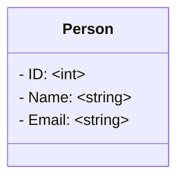

## Project
This is a simple CRUD without validation and using a generic repository to interact with GOE using only one Struct. The major idea is to show one way on how to use GOE for a basic startup project.

For more complex examples checkout the crud-advanced example.

## Database

Entities used on the project



## Running the project
```bash
PORT=8888 go run main.go
```

## APIs

This examples are using `curl` for easy re-use, but you can also use any API client (e.g. Bruno, Postman).

### Get List
Return the data per page using GOE `AsPagination` function.

#### URL Parameters
- page (int)
  - page number
- size (int)
  - number of elements per page

#### Usage

```bash
curl -H "Accept: application/json" "http://localhost:8888/persons?page=1&size=5"
```

### Get One

#### URL Parameters
- id (int)
  - id of the resource

```bash
curl -H "Accept: application/json" "http://localhost:8888/persons/1"
```

### Post

#### Body request

```json
{
    "name":"John Constantine",
    "email":"devilmaycry@yooou.com"
}
```

```bash
curl -X POST \
-H "Content-Type: application/json" \
-H "Accept: application/json" \
-d '{"name":"John Constantine", "email":"devilmaycry@yooou.com"}' "http://localhost:8888/persons"
```

### Put

#### URL Parameters
- id (int)
  - id of the resource

#### Body request

```json
{
    "name":"John Constantine",
    "email":"devilmaycry@yooou.com"
}
```

```bash
curl -X PUT \
-H "Content-Type: application/json" \
-H "Accept: application/json" \
-d '{"name":"John Constantine Update", "email":"devilmaycry@yooou.com"}' "http://localhost:8888/persons/1"
```

### Delete

#### Parameters
- id (int)
  - id of the resource

```bash
curl -X DELETE \
-H "Accept: application/json" "http://localhost:8888/persons/1"
```