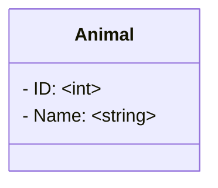

This one-file-crud uses fuego as the web framework, and fuego has a amazing feature of generate a openAPI.json and swagger-ui, so you can easily test your apis without any other setup.

The idea of this CRUD was to make a valid application in less than 100 lines, having logger, validations and paginated data.

This CRUD has:
- Create (POST)
- Delete (DELETE)
- Update (PUT)
- List (GET)
- Find (GET)

List is paginated and has a filter by the name of the animal.

## Database

## Setup
- `go mod tidy` to download the packages
- `go run main.go` 
- access: `http://localhost:9999/swagger/index.html`